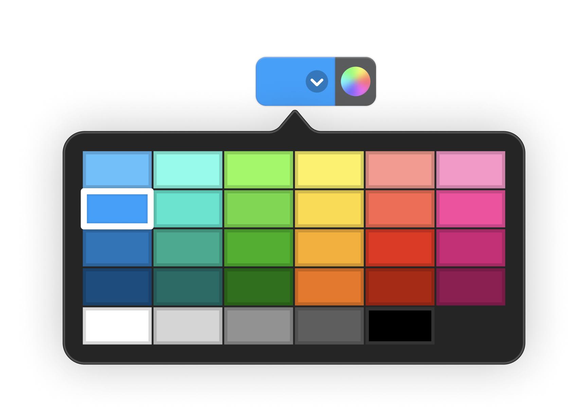
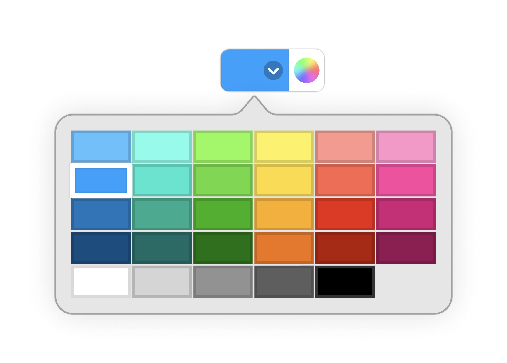
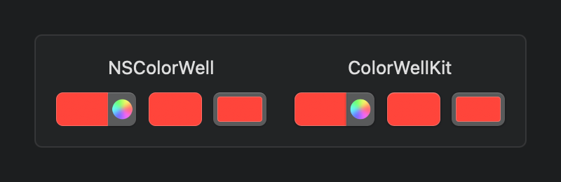
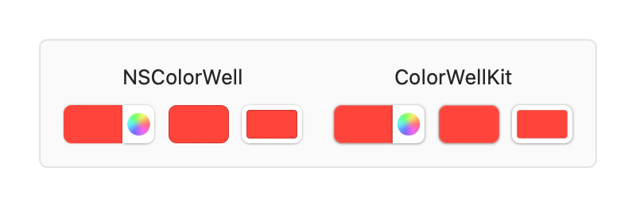

# ColorWellKit

[![Continuous Integration][ci-badge]](https://github.com/jordanbaird/ColorWellKit/actions/workflows/test.yml)
[![Release][release-badge]](https://github.com/jordanbaird/ColorWellKit/releases/latest)
[![Swift Versions][versions-badge]](https://swiftpackageindex.com/jordanbaird/ColorWellKit)
[![Docs][docs-badge]](https://swiftpackageindex.com/jordanbaird/ColorWellKit/documentation)
[![License][license-badge]](LICENSE)

A versatile alternative to `NSColorWell` for Cocoa and `ColorPicker` for SwiftUI.

<div align="center">
    
    
</div>

ColorWellKit is designed to mimic the appearance and behavior of the color well designs introduced in macOS 13 Ventura, ideal for use in apps that are unable to target the latest SDK. While a central goal of ColorWellKit is to maintain a similar look and behave in a similar way to Apple's design, it is not intended to be an exact clone. There are a number of subtle design differences ranging from the way system colors are handled to the size of the drop shadow. In practice, there are very few notable differences:

<div align="center">
    
    
</div>

## Install

Add the following dependency to your `Package.swift` file:

```swift
.package(url: "https://github.com/jordanbaird/ColorWellKit", from: "1.1.1")
```

## Usage

[Read the full documentation here](https://swiftpackageindex.com/jordanbaird/ColorWellKit/documentation)

### SwiftUI

Create a `ColorWell` and add it to your view hierarchy. There are a wide range of initializers and modifiers to choose from, allowing you to set the color well's color, label, and style.

```swift
import SwiftUI
import ColorWellKit

struct ContentView: View {
    @Binding var textColor: Color

    var body: some View {
        VStack {
            ColorWell("Text Color", selection: $textColor)
                .colorWellStyle(.expanded)

            MyCustomTextEditor(textColor: $textColor)
        }
    }
}
```

### Cocoa

Create a `CWColorWell` using one of the available initializers, or use an `IBOutlet` to create a connection to a Storyboard or NIB file. Respond to color changes using your preferred design pattern.

```swift
import Cocoa
import ColorWellKit

class ViewController: NSViewController {
    @IBOutlet var colorWell: CWColorWell!
    @IBOutlet var textEditor: NSTextView!

    override func viewDidLoad() {
        colorWell.style = .expanded
        if let textColor = textEditor.textColor {
            colorWell.color = textColor
        }
    }

    @IBAction func updateTextColor(sender: CWColorWell) {
        textEditor.textColor = sender.color
    }
}
```

## License

ColorWellKit is available under the [MIT license](LICENSE).

[ci-badge]: https://img.shields.io/github/actions/workflow/status/jordanbaird/ColorWellKit/test.yml?branch=main&style=flat-square
[release-badge]: https://img.shields.io/github/v/release/jordanbaird/ColorWellKit?style=flat-square
[versions-badge]: https://img.shields.io/badge/dynamic/json?color=F05138&label=Swift&query=%24.message&url=https%3A%2F%2Fswiftpackageindex.com%2Fapi%2Fpackages%2Fjordanbaird%2FColorWellKit%2Fbadge%3Ftype%3Dswift-versions&style=flat-square
[docs-badge]: https://img.shields.io/static/v1?label=%20&message=documentation&logo=data:image/png;base64,iVBORw0KGgoAAAANSUhEUgAAADAAAAAwCAYAAABXAvmHAAAACXBIWXMAAAsTAAALEwEAmpwYAAAAAXNSR0IArs4c6QAAAARnQU1BAACxjwv8YQUAAAEsSURBVHgB7dntDYIwEAbgV+MAuoEj6AaO4AiO4AayAbqBbuAGjoIbwAbnHT8MMTH9uEJrvCch/FB7vEh7EABjjBMRnXhrKY1GxsNUuFhN45gmBKU783lCDKtBiYeoUoeYI79KE6KEACI6RCkBRFSIkgKI4BClBRBBIUoMILxDlBpASIgjtBL3gR2FaV1jzjyKvg98xqDEw615t3Z87eFbc/IAPkJqljwHvFiA3CxAbhaAdI+cNZTUfWD4edQBOMacog9cEE/z25514twsQG4/H2ABJZ5vG97tEefKc/QJhRR9oIH7AeWbjodchdYcSnEJLRGvg5L6EmJb3g6Ic4eSNbLcLEBuf9HIZKnrl0rtvX8E5zLr8w+o79kVbkiBT/yZxn3Z90lqVTDGOL0AoGWIIaQgyakAAAAASUVORK5CYII=&color=informational&labelColor=gray&style=flat-square
[license-badge]: https://img.shields.io/github/license/jordanbaird/ColorWellKit?style=flat-square
